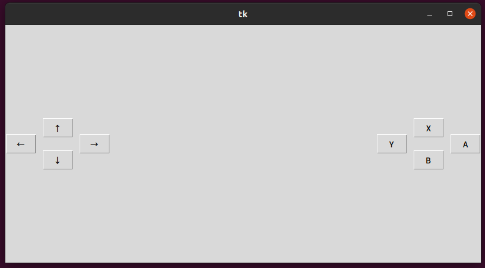
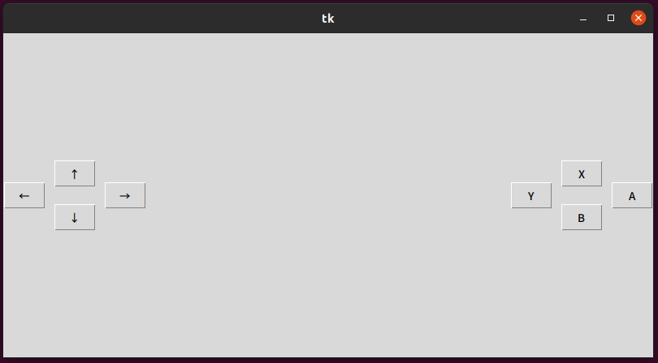
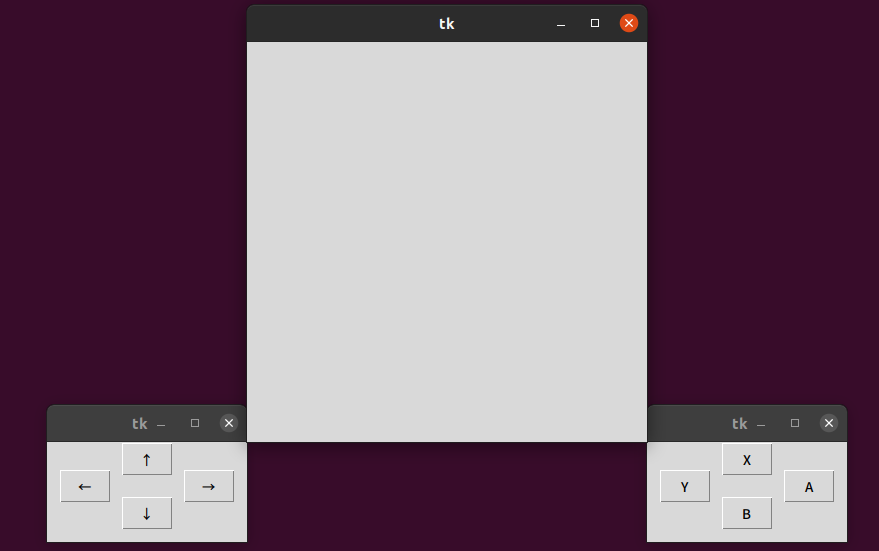

# tkinter-sample

コントローラーが外せるタイプの某ゲーム機をイメージした。  

## app1.py

[app1.py](https://github.com/eom-moe/tkinter-nintendo-switch-like-ui/blob/master/app1.py)の実行例  



以下のようにして、「4つのボタンのウィジェット」を2つ作成した。  

```
    FourButtonWidget(root, directionButtonTextList, tk.LEFT)
    FourButtonWidget(root, actionButtonTextList, tk.RIGHT)
```

FourButtonWidgetは[widgetLibrary.py](https://github.com/eom-moe/tkinter-nintendo-switch-like-ui/blob/master/widgetLibrary.py)で定義されている。  

## app2.py

[app2.py](https://github.com/eom-moe/tkinter-nintendo-switch-like-ui/blob/master/app2.py)の実行例  



以下のようにして、「4つのボタンのウィジェットを2つ含むウィジェット」を1つ作成した。  

```
    EightButtonWidget(root)
```

EightButtonWidgetは[widgetLibrary.py](https://github.com/eom-moe/tkinter-nintendo-switch-like-ui/blob/master/widgetLibrary.py)で定義されている。  

## app3.py

[app3.py](https://github.com/eom-moe/tkinter-nintendo-switch-like-ui/blob/master/app3.py)の実行例



以下のようにして、「4つのボタンのウィジェット」を子ウィンドウとして1つずつ、合計2つ作成した。  

```
    directionButtonWindow = tk.Toplevel()
    FourButtonWidget(directionButtonWindow, directionButtonTextList)

    actionButtonWindow = tk.Toplevel()
    FourButtonWidget(actionButtonWindow, actionButtonTextList)
```

app1.pyとの違いは、masterをrootではなくtk.Toplevel()にすることで、  
子ウィンドウとして表示していること。  

